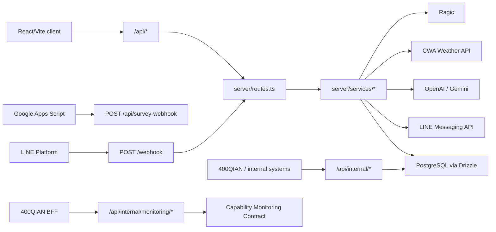

# 400lineXiao-Bang-Shou Obsidian Index

> Source of truth: current code in this repo. `replit.md` and `C:\Users\ians0\Downloads\replit (7).md` are background references only.

## Reading Order

1. [[01-System-Overview]] - what the system is and how the major parts fit.
2. [[02-Route-Map]] - every backend API route, mounted router, LINE webhook, and frontend route.
3. [[03-Module-Map]] - major backend services, routers, middleware, utilities, scripts, and client pages.
4. [[04-Data-Model]] - Drizzle tables and major data flows.
5. [[05-External-Integrations]] - LINE, OpenAI, Gemini, CWA, Ragic, Google Apps Script, and dashboard webhook.
6. [[06-Operations-And-Stability]] - startup, scheduling, health checks, deployment notes, and stability risks.
7. [[07-400QIAN-Open-Endpoints]] - 400QIAN BFF endpoints, 400LINE server-to-server routes, data grants, and maintenance rules.
8. [[99-Validation-Report]] - commands used to verify the documentation coverage.

## System Map

## Documentation Rules Used

- Runtime code, config, LINE webhook, Replit settings, database migrations, and secrets were not changed.
- Existing uncommitted work is treated as owned by another operator and is not overwritten.
- Routes are documented by effective URL after mount prefix, not only by local router path.
- Obsidian links use wiki-link style. Source references use repo-relative paths.

## Important Current Risk Notes

- `server/middleware/lineSignature.ts` currently bypasses LINE signature verification.
- `.env.example` uses `LINE_CHANNEL_SECRET` / `LINE_CHANNEL_ACCESS_TOKEN`, while runtime code reads `CHANNEL_SECRET` / `CHANNEL_ACCESS_TOKEN`.
- Some admin-looking routes in `server/routes.ts` are not protected by `authMiddleware`; this document records actual behavior and does not change it.
- `server/routes/internalRoutes.ts`, `server/routes.ts`, `server/routes/adminConsoleRoutes.ts`, and `server/services/ragicService.ts` had pre-existing local modifications during this documentation pass.
