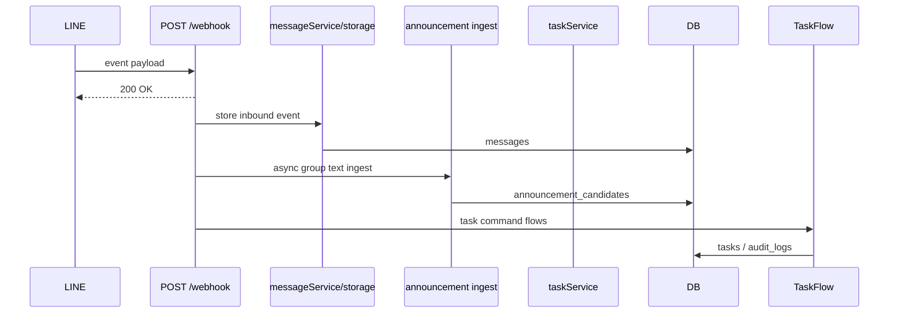
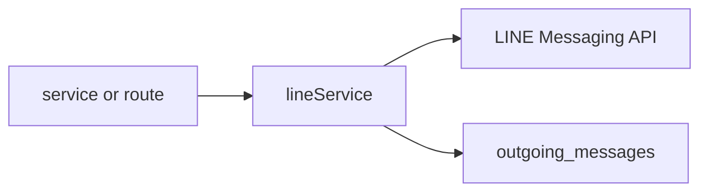
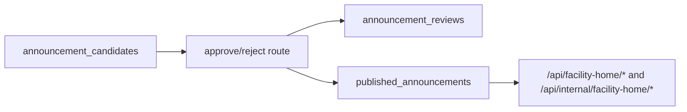
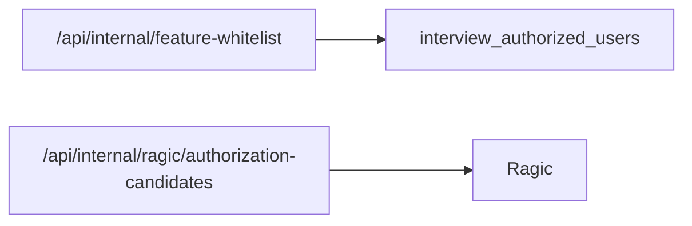

# Data Model

Related: [[00-INDEX]], [[01-System-Overview]], [[02-Route-Map]], [[03-Module-Map]]

## Database Layer

- ORM: Drizzle ORM.
- Connection: `server/db.ts` creates a Neon/PostgreSQL pool from `DATABASE_URL`.
- Main schema: `shared/schema.ts`.
- Water quality schema: `shared/waterQualitySchema.ts`.

## Main Tables

| Table | Drizzle export | Purpose | Main writers/readers |
|---|---|---|---|
| `messages` | `messages` | Stores inbound LINE events and raw JSON. | `messageService`, webhook, admin messages, announcement replay. |
| `tasks` | `tasks` | Group-isolated task records with serial IDs and status. | `taskService`, task admin/dashboard routes, scheduler. |
| `admins` | `admins` | Admin user whitelist table. | Storage/admin flows. |
| `authorized_groups` | `authorizedGroups` | Groups authorized for GPT/AI features. | AI/task authorization logic. |
| `audit_logs` | `auditLogs` | Runtime audit events for webhook, scheduler, auth, survey, water, etc. | most services, admin audit routes. |
| `outgoing_messages` | `outgoingMessages` | Records LINE bot outbound messages with status and payload. | `lineService.logOutgoing()`, storage queries. |
| `message_backups` | `messageBackups` | Stores backup snapshots. | `simpleBackupService`, backup admin commands. |
| `system_settings` | `systemSettings` | Key/value operational settings. | storage/settings flows. |
| `interview_authorized_users` | `interviewAuthorizedUsers` | LINE users allowed to use interview/internal/AI features. | startup seed, admin routes, internal feature whitelist. |
| `employee_cache` | `employeeCache` | Cached employee lookup records. | Ragic/employee lookup flows. |
| `announcement_candidates` | `announcementCandidates` | Candidate announcements detected from LINE messages or replay/mock. | announcement ingest/review routes. |
| `announcement_reviews` | `announcementReviews` | Approve/reject audit for candidates. | announcement review routes. |
| `users` | `users` | Internal user identity with employee ID, LINE UID, role. | supervisor resolver, future identity mapping. |
| `user_identity_mappings` | `userIdentityMappings` | External ID mapping for line/employee_system/portal. | identity architecture. |
| `facilities` | `facilities` | Facility master records with LINE group IDs and tier. | facility seeder, facility-home/internal APIs. |
| `published_announcements` | `publishedAnnouncements` | Approved/published announcement pool for duty/facility home. | announcement approval, facility-home APIs. |
| `announcement_whitelist_users` | `announcementWhitelistUsers` | VIP announcement whitelist, with DB/cache fallback. | `whitelistRepo`, admin/internal whitelist APIs. |
| `service_health_snapshots` | `serviceHealthSnapshots` | Periodic/manual service health snapshot history. | `dashboardPusher`, admin/internal service history. |
| `water_quality_records` | `waterQualityRecords` | Structured water quality records. | water quality subsystem. |
| `water_quality_alerts` | `waterQualityAlerts` | Water quality alert records. | water quality subsystem. |

## Critical Data Flows

### LINE inbound message

### LINE outbound message

- `lineService` records both sent and failed outbound attempts where possible.
- Logging failure is designed not to block message sending.

### Announcement approval

### Internal feature whitelist

Current implementation maps feature whitelist APIs onto `interview_authorized_users` rather than a separate feature table.

## Data Integrity Notes

- Group isolation is mainly enforced by `groupId` on `messages`, `tasks`, candidates, facilities, and published announcement filters.
- `published_announcements.appliesToFacilityIdsJson` is used with JSONB containment to determine facility visibility.
- `outgoing_messages` is important for auditability because LINE reply/push operations can fail independently from webhook success.
- Some water quality records are historically represented through `audit_logs` and in-memory cache; structured water tables also exist.

## Risk and Drift Notes

- Schema and existing production DB may not always match comments; use `drizzle-kit`/DB inspection before migrations.
- `server/routes/internalRoutes.ts` currently includes newer feature whitelist and Ragic candidate endpoints not fully reflected in older `replit.md` snapshots.
- Any migration or `db:push` is outside this documentation pass.
